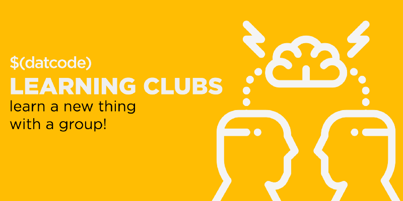

# $(datcode) Learning Clubs
## Learn a new thing with a group!

Come learn cool new things with other $(datcode) members. Head on over to the [Slack](https://datcode.slack.com/) group or if you aren't currently a member, sign up at [datcode.io](http://datcode.io).

## What We're Learning

* [Graph Databases](https://paper.dropbox.com/doc/Graph-Database-Learning-Club-9Ccx03zFpmKmTlhAjzKI5) -- learn how to traverse data in ways that you didn't think were possible.
